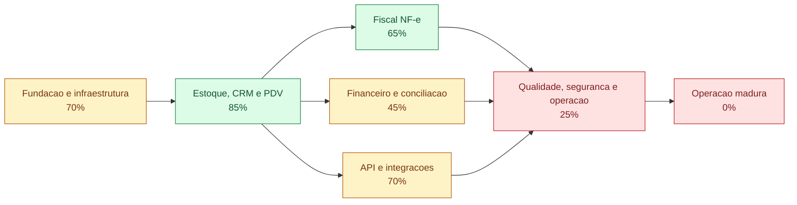

# Project Status - ERP Neto Rodas

> Memoria oficial do projeto. Leia este arquivo antes de iniciar qualquer tarefa.
>
> Ultima revisao: **2026-06-15**  
> Commit analisado: **2254bc5** (`main`)  
> Progresso geral estimado: **65%**

## 1. Visao geral

O ERP esta em producao e possui uso real nos fluxos de estoque, CRM, PDV e emissao
de NF-e. A base funcional e ampla, mas a maturidade de seguranca, testes,
migracoes e operacao financeira ainda e baixa. Os percentuais abaixo representam
entrega validada, nao apenas quantidade de arquivos existentes.

### Legenda de estados

- **Validado:** ha teste executado ou evidencia operacional observada.
- **Parcial:** existe implementacao, mas faltam cenarios, uso real ou acabamento.
- **Implementado, nao validado:** existe codigo, sem evidencia suficiente de funcionamento.
- **Planejado:** ainda nao foi implementado.
- **Bloqueado:** depende de decisao, credencial, ambiente ou correcao anterior.

## 2. Tarefa atual

### Impedir novas NF-e duplicadas e preparar a regularizacao

**Estado:** correcao implementada e validada; commit e deploy em andamento. Os 10 cancelamentos enviados foram recusados pela SEFAZ por prazo excedido.  
**Prioridade:** critica.

### Objetivo

Garantir que uma venda gere no maximo uma NF-e autorizada, reconciliar no ERP
todos os documentos ja autorizados na Focus e registrar o resultado da tentativa
de cancelamento das 10 autorizacoes excedentes.

### Criterios objetivos de conclusao

- [x] Reutilizar a referencia fiscal existente enquanto estiver processando.
- [x] Bloquear nova emissao quando a venda possuir documento autorizado.
- [x] Exibir apenas sincronizacao, PDF e cancelamento para vendas ja emitidas.
- [x] Desabilitar o botao de emissao durante o envio.
- [x] Sincronizar no ERP todas as referencias existentes antes de criar outra.
- [ ] Criar teste automatizado provando uma unica autorizacao por venda.
- [x] Reconciliar os 15 documentos consultados com numero, chave e status corretos.
- [x] Gerar relatorio das 10 notas excedentes e do motivo da recusa.
- [ ] Validar o fluxo corrigido em homologacao antes do deploy.
- [x] Enviar via Focus o cancelamento das NF-e 1148-1152, 1154, 1156, 1161 e 1163-1164.
- [x] Confirmar individualmente o resultado fiscal de cada cancelamento.

## 3. Fases

| Fase | Estado | Progresso | Evidencia atual | Resultado esperado |
|---|---|---:|---|---|
| Fundacao e infraestrutura | Parcial | 70% | Aplicacao PHP/MySQL em VPS, dominio HTTPS e deploy por Git funcionando | Ambiente reproduzivel, configuracao segura, deploy documentado e rollback previsivel |
| Estoque, CRM e PDV | Validado com ressalvas | 85% | 236 produtos, 72 clientes, 76 vendas, 83 itens vendidos e 344 movimentos em producao | Fluxos operacionais consistentes, auditaveis e cobertos por testes |
| Fiscal NF-e | Critico | 65% | 15 NF-e autorizadas para 5 vendas auditadas; 10 autorizacoes excedentes por reemissao durante processamento | Uma autorizacao por venda, estados reconciliados e regularizacao das duplicidades |
| Financeiro e conciliacao | Implementado, nao validado | 45% | Telas, API e importacao CSV/OFX existem; tabelas financeiras estao vazias em producao | Entradas, saidas e conciliacoes usadas e vinculadas a vendas/custos |
| API e integracoes | Parcial | 70% | API protegida retorna `401`; catalogo publico retorna `200`; CRM suporta autenticacao/sincronizacao externa | Contratos versionados, testes de integracao e integracoes da loja confiaveis |
| Qualidade, seguranca e operacao | Critico | 25% | 39 arquivos passam em lint; nao ha testes, CI, login administrativo ou CSRF | Seguranca por perfil, testes automatizados, CI, logs, backup e observabilidade |
| Operacao madura | Planejado | 0% | Nao ha evidencias de SLO, monitoramento, restauracao testada ou rotina formal de release | Operacao previsivel com alertas, backups testados, auditoria e indicadores |

## 4. Checklists

### Concluido

- [x] ERP publicado em `https://erp-netorodas.online`.
- [x] Navegacao administrativa responsiva.
- [x] Cadastro e edicao de produtos com categoria, estado, marca, modelo, medidas e local.
- [x] Imagem de produto e compatibilidade com varios carros.
- [x] Filtros de estoque por marca, modelo, local, carro, categoria, estado e saldo.
- [x] CRM com dados pessoais, endereco, edicao, exclusao e historico de vendas.
- [x] PDV desktop e mobile com vendedor, cliente, endereco e itens pesquisaveis.
- [x] Criacao de produto nao cadastrado durante a venda.
- [x] Idempotencia de novas vendas por `request_token`.
- [x] Estoque e movimentos atualizados de forma transacional na venda.
- [x] Dashboard com indicadores e agregacao de faturamento corrigida.
- [x] NF-e modelo 55 com emissao, sincronizacao e download de DANFE.
- [x] API REST paginada para produtos, clientes, vendas, custos e movimentos bancarios.
- [x] Catalogo publico de produtos para a loja.
- [x] API protegida rejeita acesso sem Bearer token.
- [x] Endereco completo do cliente exposto na rota protegida `GET /customers/{id}`.

### Em andamento

- [ ] Impedir novas NF-e duplicadas e preparar a regularizacao.

### Proxima fila

- [ ] Proteger o ERP administrativo e as operacoes de escrita com login, perfis e CSRF.
- [ ] Criar migracoes versionadas e remover `ALTER TABLE` executado durante requisicoes.
- [ ] Sincronizar `sql/schema.sql` com o schema real, incluindo `customers.email`.
- [ ] Criar testes automatizados para venda, estoque, fiscal, API e importacao bancaria.
- [ ] Adicionar CI para lint, testes e verificacao de schema.
- [ ] Resolver e monitorar os 3 status fiscais pendentes e documentos em processamento.
- [ ] Validar importacao CSV/OFX com extratos reais anonimizados dos tres bancos.
- [ ] Implementar conciliacao entre movimento bancario, venda, custo, conta a receber e conta a pagar.
- [ ] Definir politica de estoque negativo e alertas operacionais.
- [ ] Documentar deploy atual da VPS e remover do README o fluxo antigo como caminho principal.
- [ ] Criar rotina de backup e testar restauracao do banco.
- [ ] Adicionar logs estruturados, auditoria de alteracoes e monitoramento de erros.

## 5. Bloqueios e riscos

| Bloqueio ou risco | Impacto | Evidencia | Acao recomendada |
|---|---|---|---|
| ERP administrativo acessivel sem login | Critico: exposicao de dados e operacoes | Dashboard, estoque, PDV e vendas responderam `HTTP 200` sem sessao | Executar a tarefa atual antes de novas expansoes administrativas |
| Formularios sem protecao CSRF | Critico: operacoes podem ser disparadas por paginas externas | Nao ha implementacao CSRF no repositorio | Adicionar token por sessao a toda mutacao |
| Ausencia de testes automatizados e CI | Alto: regressao so aparece em producao | Nenhum arquivo de teste, framework ou workflow encontrado | Criar baseline de testes depois da protecao de acesso |
| Schema divergente do banco real | Alto: instalacao nova pode nascer incompleta | Producao possui `customers.email`; `sql/schema.sql` nao possui a coluna | Criar migracoes e gerar schema consolidado |
| Migracoes executadas em requisicoes | Alto: lentidao, falha concorrente e permissao DDL em runtime | `CREATE/ALTER TABLE` em paginas, API e actions | Mover alteracoes para migracoes explicitas de deploy |
| Configuracoes sensiveis rastreadas pelo Git | Alto: risco de vazamento de token e credenciais | `config/api.php`, `config/database.php` e `config/fiscal.php` sao rastreados | Migrar segredos para ambiente/arquivos locais ignorados e rotacionar credenciais |
| README descreve Cloudflare/XAMPP como publicacao principal | Medio: procedimento incorreto em futuras entregas | Producao atual esta na VPS com Nginx, mas README termina no fluxo antigo | Documentar VPS, banco, deploy, rollback e verificacao |
| Financeiro sem uso operacional comprovado | Medio: relatorios podem transmitir falsa completude | `costs`, contas e movimentos bancarios possuem zero registros em producao | Validar com lote controlado e reconciliacao manual antes de confiar nos saldos |
| Estados fiscais ainda pendentes | Alto: risco fiscal e operacional | 3 vendas `pending`; 9 documentos `processando`; 1 documento rejeitado | Criar rotina de sincronizacao, alerta e tratamento de excecao |
| NF-e autorizadas em duplicidade | Critico: obrigacao fiscal repetida e risco contabil | 15 autorizacoes para 5 vendas; 10 notas excedentes confirmadas diretamente na Focus e nos XMLs | Bloquear reemissao, reconciliar referencias e tratar cancelamento extemporaneo com contador/SEFAZ |
| Cancelamento normal das 10 NF-e excedentes fora do prazo | Critico: documentos continuam autorizados e com efeito fiscal | Focus/SEFAZ recusou todas com `Prazo de Cancelamento Superior ao Previsto na Legislacao` | Solicitar cancelamento extemporaneo conforme procedimento da SEFAZ-BA e orientacao contabil; nao repetir o DELETE comum |
| Estoque negativo existente | Medio: disponibilidade e margem podem ficar incorretas | 14 produtos com saldo negativo em producao | Definir politica, destacar excecoes e criar rotina de regularizacao |
| Ambiente local sem MySQL ativo na revisao | Baixo: validacao local incompleta | Conexao local recusada em 2026-06-13 | Subir MySQL local e criar banco descartavel para testes |

## 6. Evidencias e validacoes atuais

### Executadas em 2026-06-13

- `php -l` nos 39 arquivos PHP: **aprovado**.
- `git status`: arvore limpa antes da criacao deste painel.
- Producao: pagina inicial, dashboard, estoque, PDV e vendas responderam `HTTP 200`.
- Producao: `GET /api/public/products?limit=1` respondeu `200`.
- Producao: `GET /api/health` e `GET /api/products?limit=1` sem token responderam `401`.
- Banco de producao consultado apenas por metadados e agregados: 12 tabelas encontradas.
- MySQL local: **nao validado**, pois o servico recusou conexao.

### Executadas em 2026-06-15

- Banco de producao consultado por venda, valor e documentos fiscais vinculados.
- As 15 referencias fiscais foram consultadas diretamente na Focus por `GET /v2/nfe/{ref}`.
- Numero, serie, chave e status `autorizado` foram confirmados para cada referencia.
- Os XMLs foram baixados em memoria e conferidos por destinatario e valor total.
- Resultado: 5 vendas originaram 15 NF-e autorizadas, totalizando 10 documentos excedentes.
- Apos a auditoria, os 10 cancelamentos foram enviados pela referencia exata e recusados por prazo excedido.
- As 10 excedentes continuam `autorizado` na Focus; o ERP registrou `erro_cancelamento`.
- As NF-e mantidas 1153, 1155, 1157, 1162 e 1165 continuam autorizadas.
- As vendas 64, 67, 71, 95 e 97 continuam corretamente com status fiscal `issued`.
- Teste de idempotencia seguro na venda 64: contagem permaneceu em 6 documentos e a emissao reutilizou `NFE64T20260608161100`, sem criar nova NF-e.
- `php -l` aprovado em `includes/fiscal_focus.php`, `pages/pdv.php`, `actions/fiscal_issue.php` e `actions/fiscal_cancel.php`.
- `git diff --check`: aprovado.

| Venda | Valor confirmado no XML | NF-e autorizadas | Excedentes | Observacao |
|---|---:|---|---:|---|
| Lucas Lima | R$ 800,00 | 1148 a 1153 | 5 | ERP reconhece apenas a 1153 como autorizada |
| Anderson Anderson | R$ 1.280,00 | 1154 e 1155 | 1 | Nome difere de "Anderson Guimaraes" informado no painel |
| Marcus vinicius Santos | R$ 780,00 | 1156 e 1157 | 1 | ERP reconhece apenas a 1157 como autorizada |
| Higor Carvalho | R$ 680,00 | 1161 e 1162 | 1 | Valor no ERP e nos dois XMLs e R$ 680,00, nao R$ 380,00 |
| Edilson Barbosa barreto | R$ 1.400,00 | 1163 a 1165 | 2 | ERP reconhece apenas a 1165 como autorizada |

### Indicadores observados em producao

| Indicador | Valor |
|---|---:|
| Produtos | 236 |
| Produtos com imagem | 28 |
| Produtos com custo maior que zero | 70 |
| Produtos com preco maior que zero | 60 |
| Produtos com estoque negativo | 14 |
| Clientes | 72 |
| Clientes com endereco | 24 |
| Clientes com e-mail | 12 |
| Clientes com autenticacao externa | 1 |
| Vendas | 76 |
| Vendas com vendedor | 69 |
| Vendas com token idempotente | 35 |
| Documentos fiscais | 32 |
| NF-e autorizadas em producao | 17 |

## 7. Historico de entregas

| Data | Entrega | Estado atual | Forma de validacao registrada |
|---|---|---|---|
| 2026-05-26 | Base inicial do ERP | Parcial | Commit `afce6ea`; existencia de modulos, sem teste historico registrado |
| 2026-05-27 | Conciliacao bancaria e isolamento do PDV mobile | Implementado, nao validado | Commit `2ffcf7e`; codigo presente, tabelas bancarias vazias em producao |
| 2026-05-31 | Evolucao fiscal, CRM, PDV e importacao de extratos | Parcial | Commit `763ab89`; codigo presente e uso fiscal confirmado por dados de producao |
| 2026-06-03 | Imagens e compatibilidade de produtos com carros | Validado com ressalvas | Commit `40d2d8a`; 28 produtos com imagem e 63 vinculos produto-carro em producao |
| 2026-06-03 | Cancelamento de NF-e | Implementado, nao validado | Commit `9c135c7`; fluxo existe, mas nenhum documento cancelado foi observado nesta revisao |
| 2026-06-03 | Correcao da agregacao diaria do dashboard | Validado anteriormente | Commit `1470444`; correcao registrada no Git, sem teste automatizado permanente |
| 2026-06-06 | Navegacao responsiva e indicador semanal | Validado anteriormente | Commits `7cd3ad8` e `a7d354f`; paginas em producao responderam `200` |
| 2026-06-06 | Prevencao de vendas duplicadas | Parcial | Commit `534ac6b`; indice unico existe, mas somente 35 de 76 vendas possuem token por serem posteriores a mudanca |
| 2026-06-07 | Integracao de clientes com autenticacao externa | Parcial | Commits `2e796dc` e `5e6119c`; 1 cliente com `external_auth_id` em producao |
| 2026-06-09 | Metadados Merchant Center e acesso direto ao estoque | Parcial | Commits `fd89111` e `01b9b4c`; lint aprovado e pagina de estoque respondeu `200` |
| 2026-06-13 | Endereco do cliente na API protegida | Validado | Commit `2254bc5`; deploy na VPS, lint aprovado e API protegida preservou `401` sem token |
| 2026-06-13 | Criacao da memoria oficial do projeto | Validado | Secoes obrigatorias, tarefa unica, link no README e `git diff --check` verificados |
| 2026-06-15 | Auditoria de NF-e repetidas | Validado | Banco, API Focus e XML confirmaram 15 autorizacoes para 5 vendas e 10 documentos excedentes |
| 2026-06-15 | Prevencao de novas NF-e duplicadas | Validado localmente, deploy pendente | Teste de integracao reutilizou a NF-e 1153 e manteve a contagem de documentos; lint e `git diff --check` aprovados |
| 2026-06-15 | Tentativa de cancelar 10 NF-e excedentes | Bloqueado por prazo fiscal | DELETE enviado por referencia exata; Focus/SEFAZ manteve todas autorizadas e retornou prazo de cancelamento excedido |

## 8. Regras de trabalho com o Codex

1. Ler este arquivo antes de analisar ou editar o repositorio.
2. Trabalhar em apenas **uma entrega principal por vez**.
3. Antes de editar codigo, atualizar a secao **Tarefa atual**, seu objetivo e seus criterios.
4. Nao iniciar item da proxima fila enquanto a tarefa atual nao estiver concluida, bloqueada ou explicitamente substituida.
5. Marcar algo como concluido somente com teste executado ou evidencia operacional registrada.
6. Registrar comandos e cenarios realmente validados; nao registrar testes presumidos.
7. Ao finalizar uma entrega, atualizar fases, checklists, riscos, indicadores relevantes e historico.
8. Se um teste nao puder ser executado, registrar claramente a lacuna e o risco residual.
9. Nao reanalisar modulos sem relacao com a tarefa atual, salvo quando surgir dependencia concreta.
10. Preservar alteracoes locais e configuracoes exclusivas de producao.
11. Nunca incluir segredos, dumps, dados pessoais ou artefatos de deploy no Git.
12. Nao executar commit, push ou deploy sem pedido explicito do usuario.
13. Manter respostas concisas e apontar este painel como fonte de estado.
14. Quando houver dois repositorios envolvidos, atualizar a memoria do repositorio responsavel por cada entrega.
15. Toda mudanca de banco deve ter migracao versionada, validacao e estrategia de rollback antes do deploy.

## 9. Como atualizar este painel

Ao iniciar:

1. Atualize a data e o commit analisado.
2. Defina uma unica tarefa atual.
3. Escreva criterios verificaveis antes de editar codigo.

Ao finalizar:

1. Execute as validacoes relevantes.
2. Atualize o percentual apenas se houver nova evidencia.
3. Mova itens entre os checklists.
4. Registre riscos novos ou removidos.
5. Adicione uma linha ao historico com data, entrega, estado e validacao.
